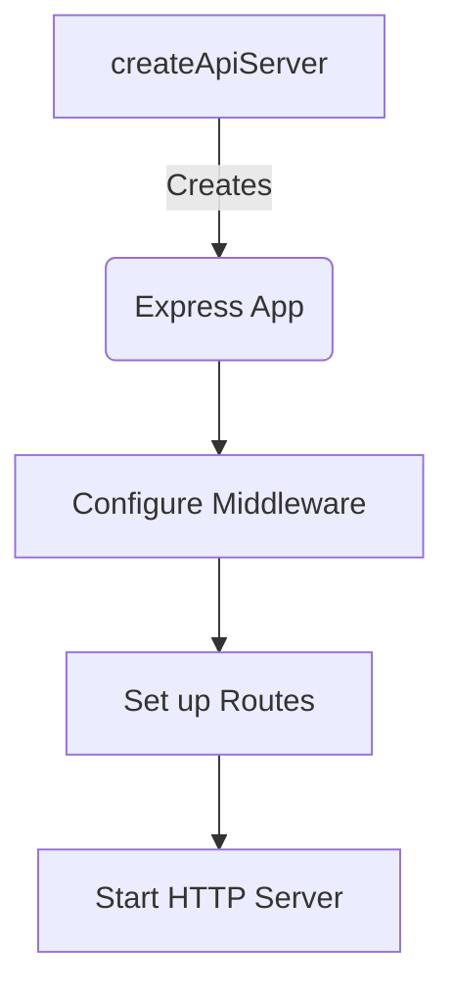
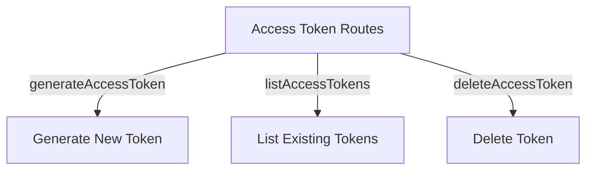
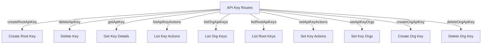

Relevant source files

The following files were used as context for generating this wiki page:

- [server/apiServer.ts](https://github.com/agattani123/pangolin/blob/main/server/apiServer.ts)
- [server/routers/accessToken/index.ts](https://github.com/agattani123/pangolin/blob/main/server/routers/accessToken/index.ts)
- [server/routers/apiKeys/index.ts](https://github.com/agattani123/pangolin/blob/main/server/routers/apiKeys/index.ts)

# API Server

## Introduction

The API Server is a core component of the project that serves as the entry point for handling incoming HTTP requests and WebSocket connections. It is built using the Express.js framework and provides a RESTful API interface for interacting with various features and services offered by the application. The API Server is responsible for setting up middleware, configuring CORS policies, handling rate limiting, and routing requests to the appropriate handlers or WebSocket connections.

Sources: [server/apiServer.ts]()

## Architecture and Configuration

### Server Setup

The `createApiServer` function is the main entry point for setting up the API Server. It creates an instance of the Express application, configures various middleware and settings, and starts the HTTP server on the specified external port.

Sources: [server/apiServer.ts:14-80]()

### Middleware Configuration

The API Server applies several middleware functions to handle various aspects of the incoming requests:

- **CORS**: The `cors` middleware is used to configure Cross-Origin Resource Sharing (CORS) policies based on the settings in the application configuration.
- **Helmet**: The `helmet` middleware is used to enhance security by setting various HTTP headers.
- **CSRF Protection**: The `csrfProtectionMiddleware` is used to protect against Cross-Site Request Forgery (CSRF) attacks.
- **Cookie Parser**: The `cookieParser` middleware is used to parse cookie headers in the incoming requests.
- **JSON Parser**: The `express.json()` middleware is used to parse JSON request bodies.
- **Request Timeout**: The `requestTimeoutMiddleware` is used to set a timeout for incoming requests, preventing potential issues with long-running or stalled requests.
- **Rate Limiting**: The `rateLimit` middleware is used to enforce rate limiting on incoming requests, preventing abuse or excessive load on the server.

Sources: [server/apiServer.ts:25-66]()

### Routing

The API Server sets up the following routes:

- **Unauthenticated Routes**: The `unauthenticated` router handles routes that do not require authentication.
- **Authenticated Routes**: The `authenticated` router handles routes that require authentication.
- **WebSocket Routes**: The `wsRouter` handles WebSocket connections and upgrades.

Sources: [server/apiServer.ts:70-72]()

### Error Handling

The API Server includes middleware functions for handling errors and not-found routes:

- **Not Found Middleware**: The `notFoundMiddleware` handles requests for routes that do not exist.
- **Error Handler Middleware**: The `errorHandlerMiddleware` handles errors that occur during request processing and sends appropriate error responses.

Sources: [server/apiServer.ts:74-75]()

## Access Token Management

The project includes functionality for managing access tokens, which are likely used for authentication and authorization purposes.

### Access Token Routes

The following routes are available for managing access tokens:

- `generateAccessToken`: This route is likely used to generate a new access token.
- `listAccessTokens`: This route is likely used to retrieve a list of existing access tokens.
- `deleteAccessToken`: This route is likely used to delete an existing access token.

Sources: [server/routers/accessToken/index.ts]()

## API Key Management

The project includes functionality for managing API keys, which are likely used for authentication and authorization purposes, potentially for external integrations or third-party applications.

### API Key Routes

The following routes are available for managing API keys:

- `createRootApiKey`: This route is likely used to create a new root-level API key.
- `deleteApiKey`: This route is likely used to delete an existing API key.
- `getApiKey`: This route is likely used to retrieve details of a specific API key.
- `listApiKeyActions`: This route is likely used to list the actions or permissions associated with an API key.
- `listOrgApiKeys`: This route is likely used to list API keys associated with a specific organization.
- `listRootApiKeys`: This route is likely used to list all root-level API keys.
- `setApiKeyActions`: This route is likely used to set or update the actions or permissions associated with an API key.
- `setApiKeyOrgs`: This route is likely used to associate an API key with one or more organizations.
- `createOrgApiKey`: This route is likely used to create a new API key associated with a specific organization.
- `deleteOrgApiKey`: This route is likely used to delete an API key associated with a specific organization.

Sources: [server/routers/apiKeys/index.ts]()

## Conclusion

The API Server is a critical component of the project, responsible for handling incoming HTTP requests and WebSocket connections. It provides a RESTful API interface for interacting with various features and services, including access token management and API key management. The server is configured with middleware for handling CORS policies, rate limiting, request timeouts, and error handling. The routing system separates authenticated and unauthenticated routes, as well as WebSocket routes. The access token and API key management functionality allows for creating, listing, updating, and deleting tokens and keys, which are likely used for authentication and authorization purposes within the application.