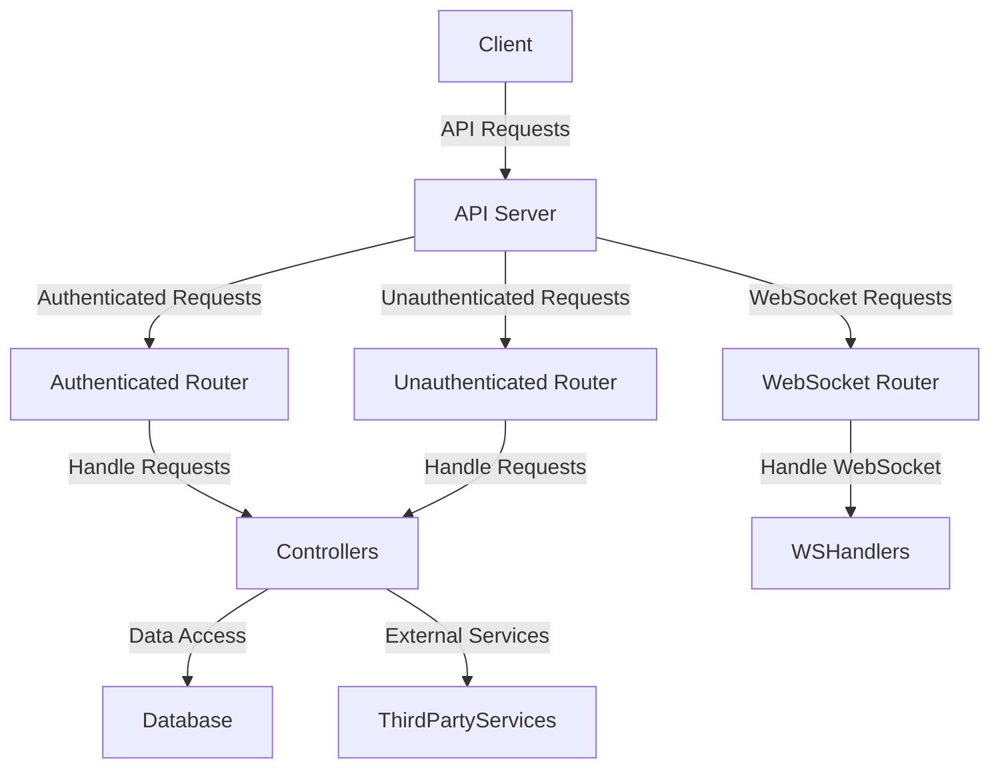
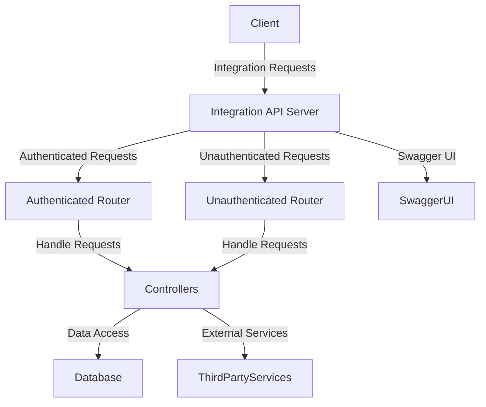
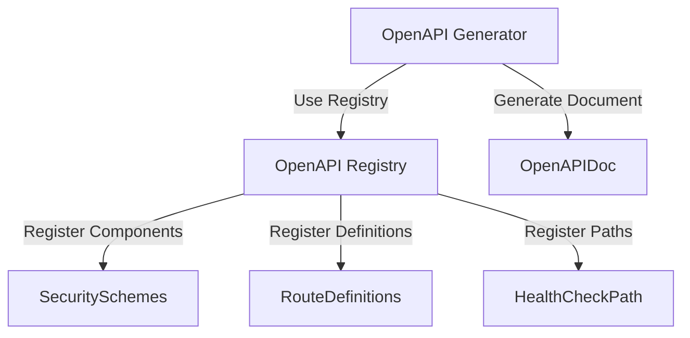
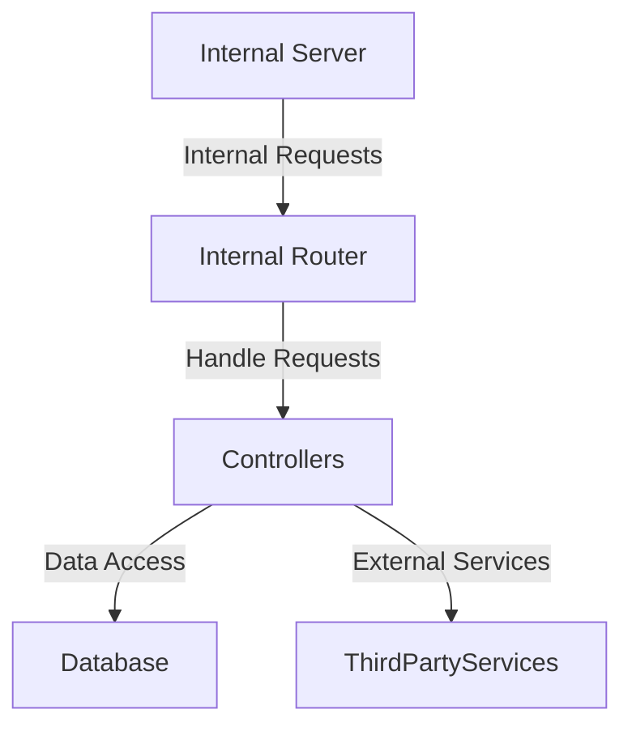

Relevant source files

The following files were used as context for generating this wiki page:

- [server/apiServer.ts](https://github.com/agattani123/pangolin/blob/main/server/apiServer.ts)
- [server/integrationApiServer.ts](https://github.com/agattani123/pangolin/blob/main/server/integrationApiServer.ts)
- [server/internalServer.ts](https://github.com/agattani123/pangolin/blob/main/server/internalServer.ts)
- [server/middlewares/logIncoming.ts](https://github.com/agattani123/pangolin/blob/main/server/middlewares/logIncoming.ts)
- [server/middlewares/csrfProtection.ts](https://github.com/agattani123/pangolin/blob/main/server/middlewares/csrfProtection.ts)

# Backend Systems

## Introduction

The backend systems in this project consist of three main servers: the API Server, the Integration API Server, and the Internal Server. These servers handle various aspects of the application, including external API requests, integration with third-party services, and internal operations. The API Server serves as the primary entry point for external clients, while the Integration API Server provides a dedicated interface for integrating with other systems. The Internal Server handles internal operations and tasks within the application.

Sources: [server/apiServer.ts](), [server/integrationApiServer.ts](), [server/internalServer.ts]()

## API Server

The API Server is the main server responsible for handling external API requests from clients. It is built using the Express.js framework and includes various middleware and configurations for security, rate limiting, CORS handling, and error handling.

### Architecture and Components

Sources: [server/apiServer.ts:1-114]()

### Middleware and Configuration

The API Server utilizes various middleware for different purposes:

- **CORS (Cross-Origin Resource Sharing)**: Handles CORS configuration based on the server settings.
  - Sources: [server/apiServer.ts:24-44]()
- **Helmet**: Adds various security headers to the server responses (only in production).
  - Sources: [server/apiServer.ts:47]()
- **CSRF (Cross-Site Request Forgery) Protection**: Protects against CSRF attacks (only in production).
  - Sources: [server/apiServer.ts:49]()
- **Cookie Parser**: Parses cookies from incoming requests.
  - Sources: [server/apiServer.ts:51]()
- **Request Timeout**: Sets a timeout for incoming requests to prevent hanging connections.
  - Sources: [server/apiServer.ts:55]()
- **Rate Limiting**: Limits the number of requests a client can make within a specific time window (only in production).
  - Sources: [server/apiServer.ts:58-77]()
- **Request Logging**: Logs incoming requests for monitoring and debugging purposes.
  - Sources: [server/apiServer.ts:81](), [server/middlewares/logIncoming.ts]()

### Routing

The API Server defines the following routes:

- `/api/v1`: Prefix for all API routes.
  - **Unauthenticated Routes**: Handles requests that do not require authentication.
    - Sources: [server/apiServer.ts:83]()
  - **Authenticated Routes**: Handles requests that require authentication.
    - Sources: [server/apiServer.ts:84]()
  - **WebSocket Routes**: Handles WebSocket connections and upgrades.
    - Sources: [server/apiServer.ts:87]()

### Error Handling

The API Server includes middleware for handling errors and not found routes:

- **Not Found Middleware**: Handles requests for non-existent routes.
  - Sources: [server/apiServer.ts:92]()
- **Error Handler Middleware**: Handles errors and sends appropriate error responses.
  - Sources: [server/apiServer.ts:93]()

## Integration API Server

The Integration API Server is a separate server dedicated to handling integration with third-party services and providing a documented API interface using Swagger UI.

### Architecture and Components

Sources: [server/integrationApiServer.ts:1-54]()

### Middleware and Configuration

The Integration API Server includes similar middleware to the API Server, such as CORS handling, Helmet security headers, and cookie parsing. Additionally, it includes the following:

- **Swagger UI**: Serves the Swagger UI documentation for the Integration API.
  - Sources: [server/integrationApiServer.ts:26-29]()

### Routing

The Integration API Server defines the following routes:

- `/v1`: Prefix for all API routes.
  - **Unauthenticated Routes**: Handles requests that do not require authentication.
    - Sources: [server/integrationApiServer.ts:33]()
  - **Authenticated Routes**: Handles requests that require authentication.
    - Sources: [server/integrationApiServer.ts:34]()

### OpenAPI Documentation

The Integration API Server generates OpenAPI documentation for the API using the `@asteasolutions/zod-to-openapi` library. The documentation includes information about the API routes, request/response schemas, and security configurations.

Sources: [server/integrationApiServer.ts:38-69]()

### Error Handling

Similar to the API Server, the Integration API Server includes middleware for handling errors and not found routes.

- **Not Found Middleware**: Handles requests for non-existent routes.
  - Sources: [server/integrationApiServer.ts:37]()
- **Error Handler Middleware**: Handles errors and sends appropriate error responses.
  - Sources: [server/integrationApiServer.ts:38]()

## Internal Server

The Internal Server is a separate server dedicated to handling internal operations and tasks within the application.

### Architecture and Components

Sources: [server/internalServer.ts:1-22]()

### Middleware and Configuration

The Internal Server includes the following middleware:

- **Helmet**: Adds various security headers to the server responses.
  - Sources: [server/internalServer.ts:6]()
- **CORS**: Enables CORS for the Internal Server.
  - Sources: [server/internalServer.ts:7]()
- **Cookie Parser**: Parses cookies from incoming requests.
  - Sources: [server/internalServer.ts:8]()
- **JSON Parser**: Parses JSON request bodies.
  - Sources: [server/internalServer.ts:9]()

### Routing

The Internal Server defines the following route:

- `/api/v1`: Prefix for all internal API routes.
  - **Internal Routes**: Handles internal requests within the application.
    - Sources: [server/internalServer.ts:12]()

### Error Handling

Similar to the other servers, the Internal Server includes middleware for handling errors and not found routes.

- **Not Found Middleware**: Handles requests for non-existent routes.
  - Sources: [server/internalServer.ts:15]()
- **Error Handler Middleware**: Handles errors and sends appropriate error responses.
  - Sources: [server/internalServer.ts:16]()

## Security Considerations

The backend systems implement various security measures to protect against common web vulnerabilities:

- **CSRF Protection**: Protects against Cross-Site Request Forgery attacks by validating CSRF tokens for authenticated requests (only in production).
  - Sources: [server/apiServer.ts:49](), [server/middlewares/csrfProtection.ts]()
- **Helmet**: Adds various security headers to the server responses, such as X-XSS-Protection, X-Frame-Options, and others (only in production).
  - Sources: [server/apiServer.ts:47](), [server/internalServer.ts:6]()
- **Rate Limiting**: Limits the number of requests a client can make within a specific time window to prevent abuse and DDoS attacks (only in production).
  - Sources: [server/apiServer.ts:58-77]()

## Conclusion

The backend systems in this project consist of three main servers: the API Server, the Integration API Server, and the Internal Server. Each server serves a specific purpose and includes various middleware, configurations, and security measures to ensure proper functionality and protection. The API Server handles external API requests, the Integration API Server provides a dedicated interface for integrating with third-party services, and the Internal Server handles internal operations within the application.