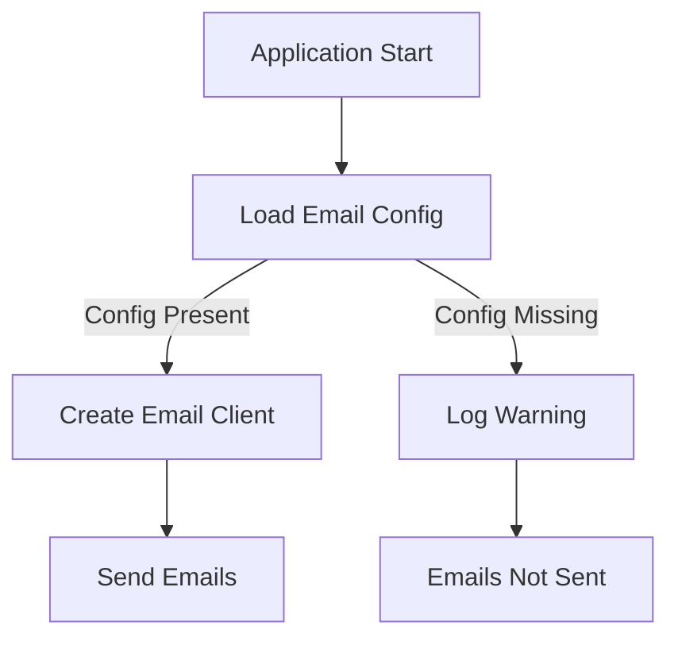
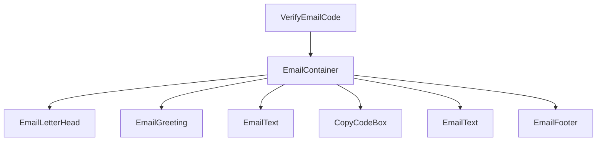
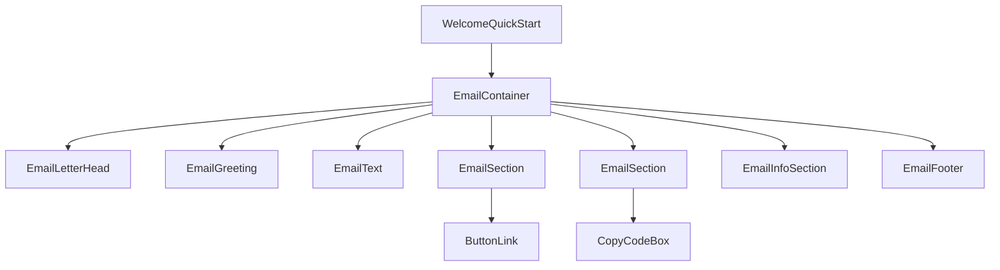
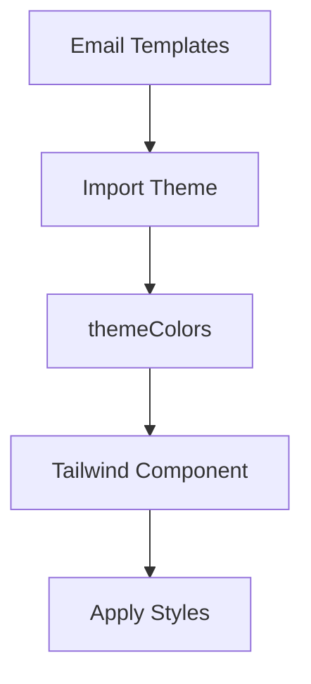

Relevant source files

The following files were used as context for generating this wiki page:

- [server/emails/index.ts](https://github.com/agattani123/pangolin/blob/main/server/emails/index.ts)
- [server/emails/templates/VerifyEmailCode.tsx](https://github.com/agattani123/pangolin/blob/main/server/emails/templates/VerifyEmailCode.tsx)
- [server/emails/templates/WelcomeQuickStart.tsx](https://github.com/agattani123/pangolin/blob/main/server/emails/templates/WelcomeQuickStart.tsx)
- [server/emails/templates/components/Email.tsx](https://github.com/agattani123/pangolin/blob/main/server/emails/templates/components/Email.tsx)
- [server/emails/templates/components/ButtonLink.tsx](https://github.com/agattani123/pangolin/blob/main/server/emails/templates/components/ButtonLink.tsx)
- [server/emails/templates/components/CopyCodeBox.tsx](https://github.com/agattani123/pangolin/blob/main/server/emails/templates/components/CopyCodeBox.tsx)
- [server/emails/templates/lib/theme.ts](https://github.com/agattani123/pangolin/blob/main/server/emails/templates/lib/theme.ts)

# Email Integration

## Introduction

The Email Integration module in the Pangolin project is responsible for sending various types of emails to users, such as verification codes, welcome messages, and quick start guides. It leverages the `nodemailer` library to handle email delivery via an SMTP server. The module includes email templates built with React components using the `@react-email/components` library, allowing for dynamic and visually appealing email content.

Sources: [server/emails/index.ts](), [server/emails/templates/VerifyEmailCode.tsx](), [server/emails/templates/WelcomeQuickStart.tsx]()

## Email Client Configuration

The Email Integration module sets up an email client using the `nodemailer` library. The client configuration is loaded from the application's configuration file (`config.getRawConfig().email`). If the email configuration is missing, a warning is logged, and emails will not be sent.

The email client is created with the following settings:

- `host`: SMTP server hostname
- `port`: SMTP server port
- `secure`: Whether to use a secure connection (TLS/SSL)
- `auth`: SMTP server authentication credentials (username and password)
- `tls`: TLS configuration options (e.g., `rejectUnauthorized`)

Sources: [server/emails/index.ts:10-35]()

## Email Templates

The Email Integration module includes two main email templates: `VerifyEmailCode` and `WelcomeQuickStart`. These templates are built using React components and the `@react-email/components` library, which provides a set of components specifically designed for rendering HTML emails.

### VerifyEmailCode Template

The `VerifyEmailCode` template is used to send a verification code to users for email address confirmation. It includes the following components:

- `EmailContainer`: Wraps the email content
- `EmailLetterHead`: Displays the application's logo or branding
- `EmailGreeting`: Greets the user
- `EmailText`: Displays instructional text
- `CopyCodeBox`: Displays the verification code in a copy-friendly format
- `EmailFooter`: Includes a signature or additional information

Sources: [server/emails/templates/VerifyEmailCode.tsx](), [server/emails/templates/components/Email.tsx](), [server/emails/templates/components/CopyCodeBox.tsx]()

### WelcomeQuickStart Template

The `WelcomeQuickStart` template is sent to new users after account creation. It provides a welcome message, a link to the application's dashboard, and instructions for connecting their site using the Newt CLI tool. It also includes information about a demo resource.

The `EmailInfoSection` component displays a table with details about the user's demo resource, including the method, hostname, port, and resource URL.

Sources: [server/emails/templates/WelcomeQuickStart.tsx](), [server/emails/templates/components/Email.tsx](), [server/emails/templates/components/ButtonLink.tsx](), [server/emails/templates/components/CopyCodeBox.tsx]()

## Theme Configuration

The Email Integration module uses a theme configuration file (`lib/theme.ts`) to define the color palette for the email templates. This configuration is imported and applied to the `Tailwind` component, which provides utility classes for styling the email content.

The `themeColors` object defines various color shades used throughout the email templates, such as primary, secondary, and grayscale colors.

Sources: [server/emails/templates/VerifyEmailCode.tsx:3](), [server/emails/templates/WelcomeQuickStart.tsx:3](), [server/emails/templates/lib/theme.ts]()

## Conclusion

The Email Integration module in the Pangolin project provides a robust and flexible solution for sending various types of emails to users. It leverages the `nodemailer` library for email delivery and the `@react-email/components` library for building visually appealing email templates using React components. The module includes templates for email verification, welcome messages, and quick start guides, with the ability to customize and extend the templates as needed.