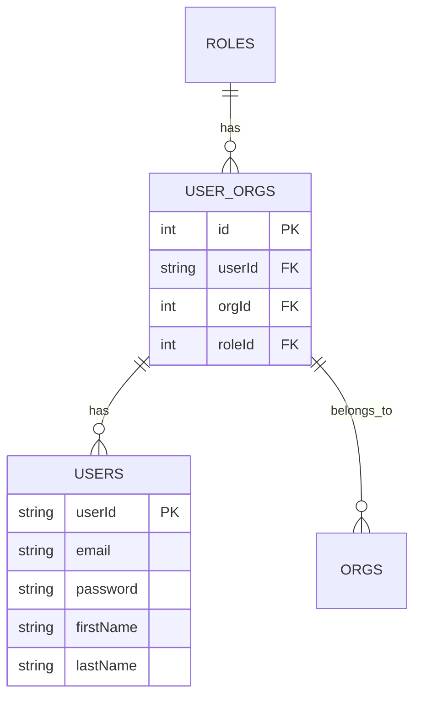
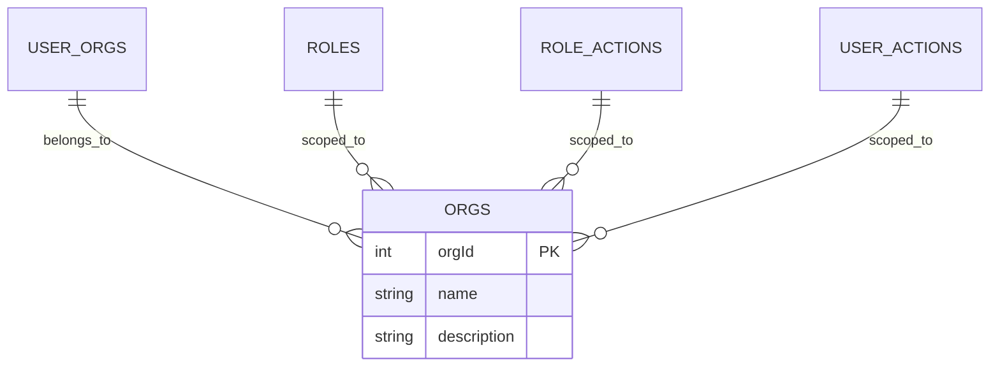
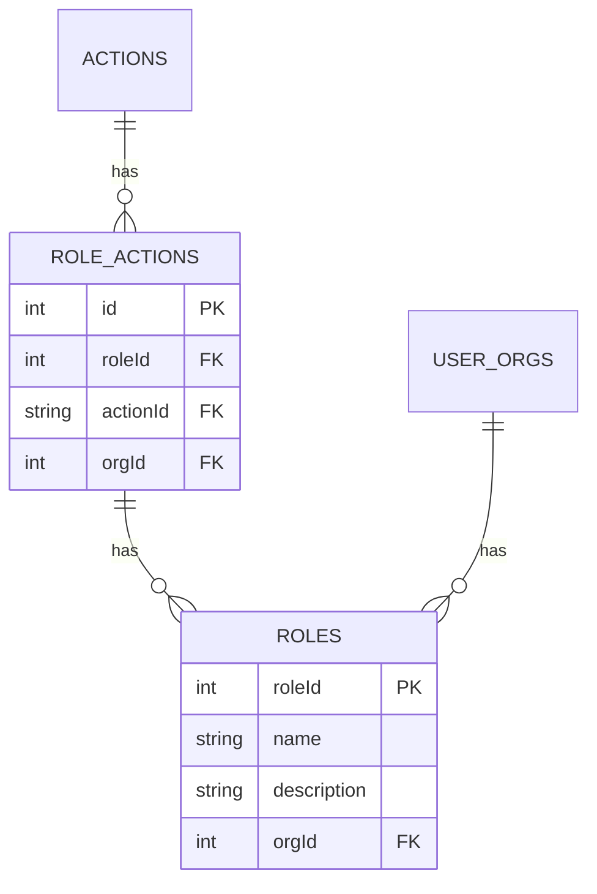
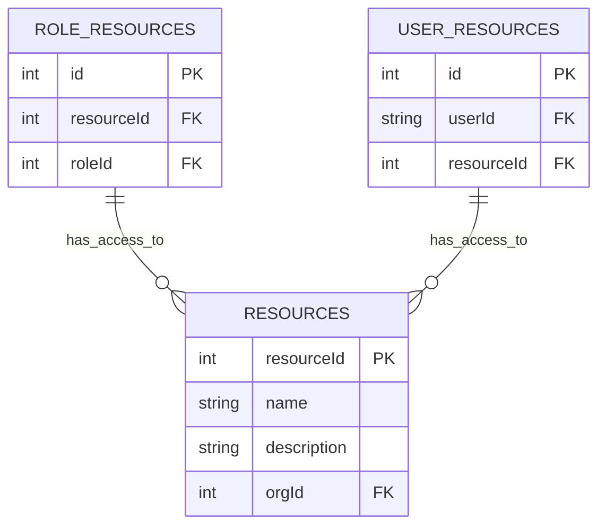
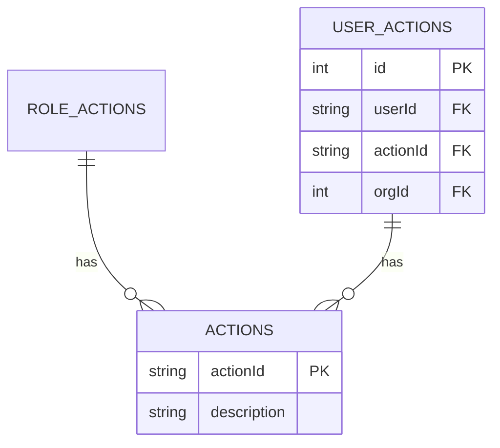
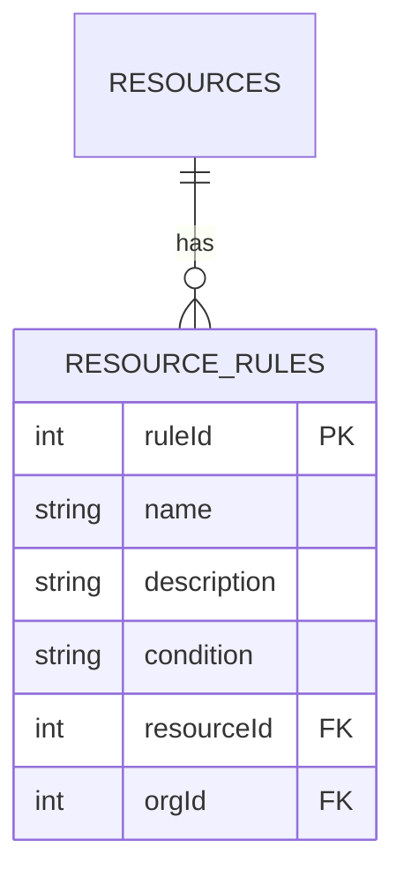
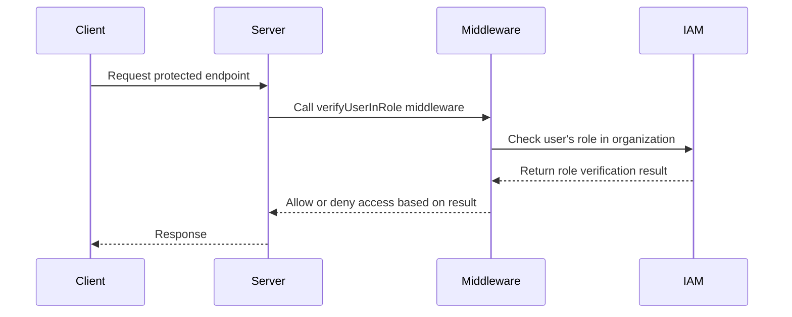

Relevant source files

The following files were used as context for generating this wiki page:

- [server/auth/actions.ts](https://github.com/agattani123/pangolin/blob/main/server/auth/actions.ts)
- [server/auth/canUserAccessResource.ts](https://github.com/agattani123/pangolin/blob/main/server/auth/canUserAccessResource.ts)
- [server/middlewares/verifyUserInRole.ts](https://github.com/agattani123/pangolin/blob/main/server/middlewares/verifyUserInRole.ts)
- [server/db/index.ts](https://github.com/agattani123/pangolin/blob/main/server/db/index.ts)
- [server/db/schema.ts](https://github.com/agattani123/pangolin/blob/main/server/db/schema.ts)

# Identity & Access Management

## Introduction

The Identity & Access Management (IAM) system in this project is responsible for managing user identities, roles, permissions, and access control for various resources within the application. It provides a comprehensive set of features and functionality to ensure secure and granular access management. The IAM system consists of several key components, including users, organizations, roles, resources, and access rules.

Sources: [server/auth/actions.ts](https://github.com/agattani123/pangolin/blob/main/server/auth/actions.ts), [server/db/schema.ts](https://github.com/agattani123/pangolin/blob/main/server/db/schema.ts)

## User Management

The IAM system maintains a user database, where each user is identified by a unique `userId`. Users can be associated with one or more organizations, and their roles and permissions within each organization are managed separately.

Sources: [server/db/schema.ts:22-40](https://github.com/agattani123/pangolin/blob/main/server/db/schema.ts#L22-L40)

### Key User Management Functions

- `createOrgUser`: Creates a new user within an organization and assigns a role.
- `listUsers`: Retrieves a list of users within an organization.
- `getOrgUser`: Retrieves information about a specific user within an organization.
- `updateUser`: Updates user information, such as name or email.
- `removeUser`: Removes a user from an organization.

Sources: [server/auth/actions.ts:18-19](https://github.com/agattani123/pangolin/blob/main/server/auth/actions.ts#L18-L19), [server/auth/actions.ts:75](https://github.com/agattani123/pangolin/blob/main/server/auth/actions.ts#L75), [server/auth/actions.ts:77](https://github.com/agattani123/pangolin/blob/main/server/auth/actions.ts#L77), [server/auth/actions.ts:79](https://github.com/agattani123/pangolin/blob/main/server/auth/actions.ts#L79)

## Organization Management

The IAM system supports the concept of organizations, which serve as logical boundaries for managing users, roles, and resources. Each organization has a unique `orgId`.

Sources: [server/db/schema.ts:42-46](https://github.com/agattani123/pangolin/blob/main/server/db/schema.ts#L42-L46)

### Key Organization Management Functions

- `createOrg`: Creates a new organization.
- `listOrgs`: Retrieves a list of organizations.
- `listUserOrgs`: Retrieves a list of organizations a user belongs to.
- `getOrg`: Retrieves information about a specific organization.
- `updateOrg`: Updates organization information, such as name or description.
- `deleteOrg`: Deletes an organization.

Sources: [server/auth/actions.ts:20-24](https://github.com/agattani123/pangolin/blob/main/server/auth/actions.ts#L20-L24)

## Role Management

The IAM system uses a role-based access control (RBAC) model, where roles are defined within each organization. Roles are assigned to users, and permissions are granted to roles, allowing for fine-grained access control.

Sources: [server/db/schema.ts:48-58](https://github.com/agattani123/pangolin/blob/main/server/db/schema.ts#L48-L58)

### Key Role Management Functions

- `createRole`: Creates a new role within an organization.
- `listRoles`: Retrieves a list of roles within an organization.
- `getRole`: Retrieves information about a specific role.
- `updateRole`: Updates role information, such as name or description.
- `deleteRole`: Deletes a role from an organization.
- `addUserRole`: Assigns a role to a user within an organization.

Sources: [server/auth/actions.ts:61-66](https://github.com/agattani123/pangolin/blob/main/server/auth/actions.ts#L61-L66), [server/auth/actions.ts:88](https://github.com/agattani123/pangolin/blob/main/server/auth/actions.ts#L88)

## Resource Management

The IAM system manages access to various resources within the application. Resources can be anything from API endpoints, data records, or application features. Each resource is identified by a unique `resourceId`.

Sources: [server/db/schema.ts:60-72](https://github.com/agattani123/pangolin/blob/main/server/db/schema.ts#L60-L72)

### Key Resource Management Functions

- `createResource`: Creates a new resource within an organization.
- `listResources`: Retrieves a list of resources within an organization.
- `getResource`: Retrieves information about a specific resource.
- `updateResource`: Updates resource information, such as name or description.
- `deleteResource`: Deletes a resource from an organization.
- `setResourceUsers`: Assigns a list of users to a resource.
- `setResourceRoles`: Assigns a list of roles to a resource.
- `listResourceUsers`: Retrieves a list of users with access to a resource.
- `listResourceRoles`: Retrieves a list of roles with access to a resource.

Sources: [server/auth/actions.ts:25-34](https://github.com/agattani123/pangolin/blob/main/server/auth/actions.ts#L25-L34), [server/auth/actions.ts:69-70](https://github.com/agattani123/pangolin/blob/main/server/auth/actions.ts#L69-L70), [server/auth/actions.ts:72-73](https://github.com/agattani123/pangolin/blob/main/server/auth/actions.ts#L72-L73)

## Access Control

The IAM system provides mechanisms for controlling access to resources based on user roles and permissions. This is achieved through the use of actions and access rules.

### Actions

Actions represent specific operations or permissions within the application. Each action is identified by a unique `actionId`.

Sources: [server/db/schema.ts:74-82](https://github.com/agattani123/pangolin/blob/main/server/db/schema.ts#L74-L82)

### Access Rules

Access rules define the conditions under which a user or role is granted or denied access to a specific resource. These rules can be based on various factors, such as user roles, resource properties, or custom logic.

Sources: [server/db/schema.ts:84-90](https://github.com/agattani123/pangolin/blob/main/server/db/schema.ts#L84-L90)

### Key Access Control Functions

- `checkUserActionPermission`: Checks if a user has permission to perform a specific action within an organization, considering both direct user permissions and role-based permissions.
- `canUserAccessResource`: Checks if a user has access to a specific resource based on their role or direct resource assignment.
- `createResourceRule`: Creates a new access rule for a resource.
- `listResourceRules`: Retrieves a list of access rules for a resource.
- `updateResourceRule`: Updates an existing access rule.
- `deleteResourceRule`: Deletes an access rule from a resource.

Sources: [server/auth/actions.ts:115-161](https://github.com/agattani123/pangolin/blob/main/server/auth/actions.ts#L115-L161), [server/auth/canUserAccessResource.ts](https://github.com/agattani123/pangolin/blob/main/server/auth/canUserAccessResource.ts), [server/auth/actions.ts:97-100](https://github.com/agattani123/pangolin/blob/main/server/auth/actions.ts#L97-L100)

## Access Verification Middleware

The project includes a middleware function `verifyUserInRole` that checks if a user has access to a specific role within an organization. This middleware can be used to protect routes or endpoints that require a certain role for access.

The `verifyUserInRole` middleware performs the following steps:

1. Extracts the `roleId` from the request parameters, body, or query.
2. Retrieves the user's `userOrgRoleId` from the request object.
3. Validates the `roleId` and `userOrgRoleId`.
4. If the `userOrgRoleId` matches the requested `roleId`, the middleware allows the request to proceed.
5. If the roles do not match, the middleware denies access with a `403 Forbidden` error.

Sources: [server/middlewares/verifyUserInRole.ts](https://github.com/agattani123/pangolin/blob/main/server/middlewares/verifyUserInRole.ts)

## Conclusion

The Identity & Access Management system in this project provides a comprehensive set of features for managing user identities, organizations, roles, resources, and access control. It follows a role-based access control model and allows for fine-grained control over resource access through the use of actions and access rules. The system also includes middleware for verifying user roles, ensuring secure access to protected endpoints.