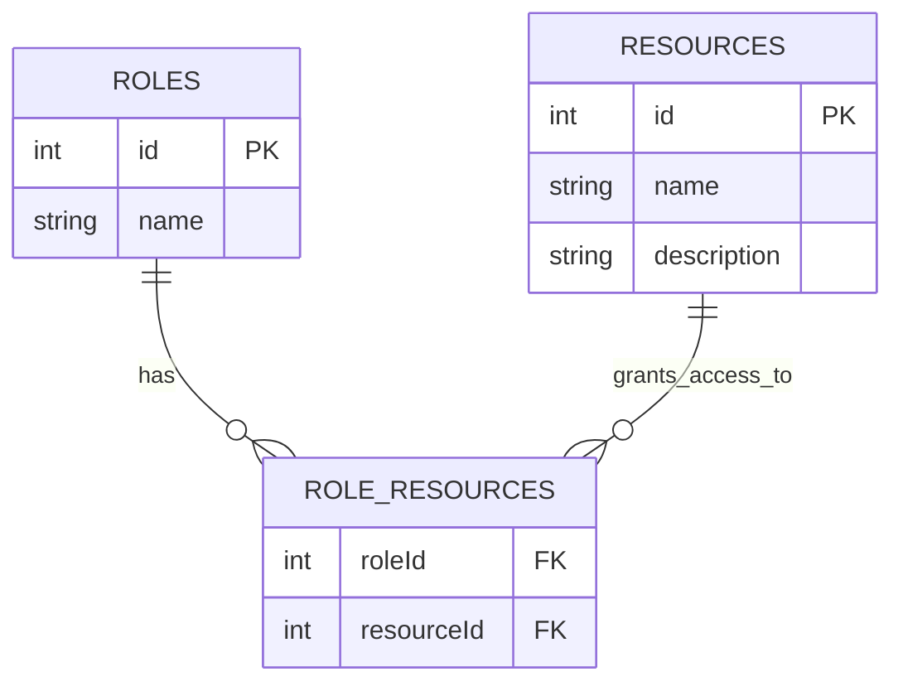
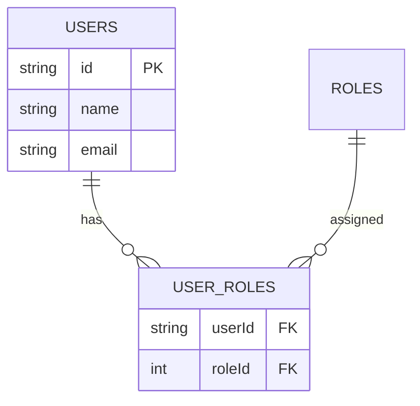
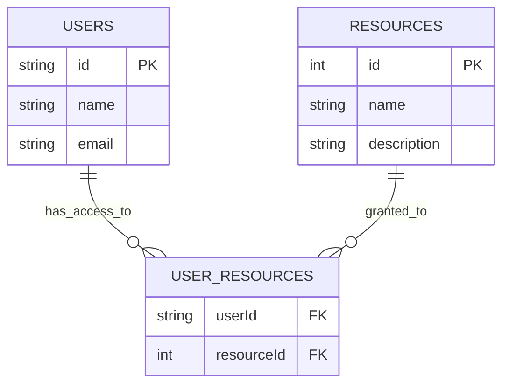

<details>
<summary>Relevant source files</summary>

The following files were used as context for generating this wiki page:

- [server/lib/canUserAccessResource.ts](https://github.com/agattani123/pangolin/blob/main/server/lib/canUserAccessResource.ts)
- [server/db/index.ts]()
- [server/db/schema.ts]()
- [server/db/tables.ts]()
- [server/db/migrations/0001_initial.sql]()

</details>

# Resource Management

## Introduction

The Resource Management system within the project is responsible for controlling access to resources based on user roles and individual user permissions. It provides a mechanism to determine whether a user is authorized to access a specific resource based on their assigned role or direct resource access grants. This system is crucial for implementing access control and ensuring data security within the application.

## Role-Based Access Control (RBAC)

The Role-Based Access Control (RBAC) model is a fundamental aspect of the Resource Management system. It allows resources to be associated with specific roles, granting access to users who are assigned those roles.

### Role-Resource Mapping

The `roleResources` table in the database stores the mapping between roles and resources. Each entry in this table represents a role's permission to access a particular resource.



Sources: [server/db/schema.ts](), [server/db/migrations/0001_initial.sql]()

### User-Role Assignment

Users are assigned one or more roles, which determine their access privileges based on the role-resource mappings.



Sources: [server/db/schema.ts](), [server/db/migrations/0001_initial.sql]()

## Direct User-Resource Access

In addition to role-based access control, the system supports direct user-resource access grants. This allows granting or revoking access to specific resources for individual users, regardless of their assigned roles.

The `userResources` table stores the direct user-resource access mappings.



Sources: [server/db/schema.ts](), [server/db/migrations/0001_initial.sql]()

## Access Check Logic

The `canUserAccessResource` function in `server/lib/canUserAccessResource.ts` is the core logic for determining whether a user has access to a specific resource. It checks both the role-based and direct user-resource access mappings.

```mermaid
flowchart TD
    start([Start]) --> check_role_access
    check_role_access{Check Role-Resource Access} -->|Access Granted| return_true([Return True])
    check_role_access -->|Access Not Granted| check_user_access{Check Direct User-Resource Access}
    check_user_access -->|Access Granted| return_true
    check_user_access -->|Access Not Granted| return_false([Return False])
    return_true --> end([End])
    return_false --> end
```

1. The function first checks if the user's role has access to the requested resource by querying the `roleResources` table.
2. If a matching entry is found, the function returns `true`, indicating that the user has access.
3. If no role-based access is found, the function checks the `userResources` table for a direct user-resource access mapping.
4. If a matching entry is found, the function returns `true`, indicating that the user has access.
5. If no role-based or direct user-resource access is found, the function returns `false`, denying access to the resource.

```typescript
export async function canUserAccessResource({
    userId,
    resourceId,
    roleId
}: {
    userId: string;
    resourceId: number;
    roleId: number;
}): Promise<boolean> {
    // Check role-resource access
    const roleResourceAccess = await db
        .select()
        .from(roleResources)
        .where(
            and(
                eq(roleResources.resourceId, resourceId),
                eq(roleResources.roleId, roleId)
            )
        )
        .limit(1);

    if (roleResourceAccess.length > 0) {
        return true;
    }

    // Check direct user-resource access
    const userResourceAccess = await db
        .select()
        .from(userResources)
        .where(
            and(
                eq(userResources.userId, userId),
                eq(userResources.resourceId, resourceId)
            )
        )
        .limit(1);

    if (userResourceAccess.length > 0) {
        return true;
    }

    return false;
}
```

Sources: [server/lib/canUserAccessResource.ts]()

## Summary

The Resource Management system in this project provides a comprehensive access control mechanism based on roles and direct user-resource mappings. It allows resources to be associated with specific roles, and users to be assigned those roles to inherit the corresponding access privileges. Additionally, direct user-resource access grants can be defined, allowing for fine-grained control over individual user permissions. The `canUserAccessResource` function serves as the central logic for determining whether a user has access to a requested resource, considering both role-based and direct user-resource access mappings.