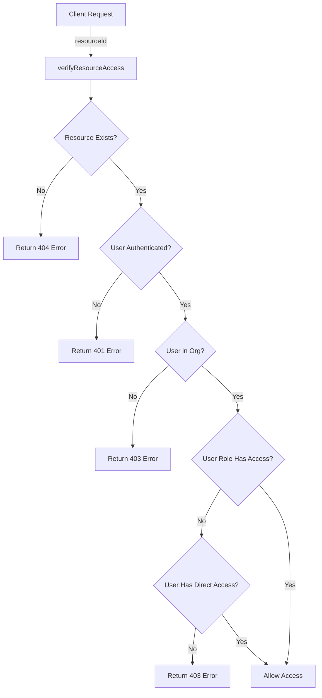
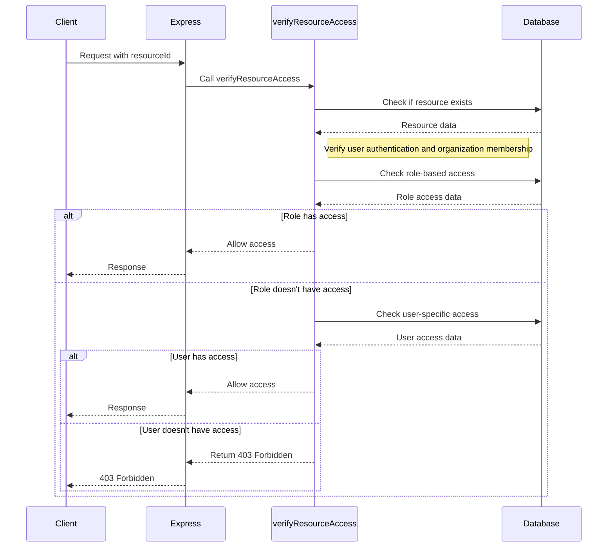

<details>
<summary>Relevant source files</summary>

The following files were used as context for generating this wiki page:

- [bruno/Traefik/traefik-config.bru](https://github.com/agattani123/pangolin/blob/main/bruno/Traefik/traefik-config.bru)
- [install/config/traefik/traefik_config.yml](https://github.com/agattani123/pangolin/blob/main/install/config/traefik/traefik_config.yml)
- [server/middlewares/verifyResourceAccess.ts](https://github.com/agattani123/pangolin/blob/main/server/middlewares/verifyResourceAccess.ts)

</details>

# Reverse Proxy & Tunneling

## Introduction

The "Reverse Proxy & Tunneling" feature in this project is responsible for managing and routing incoming HTTP/HTTPS requests to the appropriate backend services or resources. It acts as an intermediary between clients and the internal application components, providing a single entry point for external traffic. This feature leverages the Traefik reverse proxy and load balancer to handle request routing, SSL/TLS termination, and dynamic configuration updates.

The reverse proxy functionality is crucial for exposing internal services securely to the outside world, load balancing across multiple instances, and enabling features like SSL termination and path-based routing. The tunneling aspect allows for secure communication between the reverse proxy and the backend services, potentially across different networks or environments.

Sources: [bruno/Traefik/traefik-config.bru](), [install/config/traefik/traefik_config.yml]()

## Traefik Configuration

Traefik is the reverse proxy and load balancer used in this project. Its configuration is defined in the `traefik_config.yml` file, which specifies various settings and providers for dynamic configuration updates.

### API and Dashboard

Traefik exposes an insecure API and dashboard for monitoring and management purposes.

```yaml
api:
  insecure: true
  dashboard: true
```

Sources: [install/config/traefik/traefik_config.yml:1-3]()

### Configuration Providers

Traefik supports multiple configuration providers to dynamically update its routing rules and settings. This project uses two providers:

1. **HTTP Provider**: Traefik polls the `/api/v1/traefik-config` endpoint on the `pangolin` service at a specified interval to retrieve configuration updates.

```yaml
providers:
  http:
    endpoint: "http://pangolin:3001/api/v1/traefik-config"
    pollInterval: "5s"
```

Sources: [install/config/traefik/traefik_config.yml:6-9](), [bruno/Traefik/traefik-config.bru]()

2. **File Provider**: Traefik also watches for changes in the `/etc/traefik/dynamic_config.yml` file and applies the configuration updates.

```yaml
providers:
  file:
    filename: "/etc/traefik/dynamic_config.yml"
```

Sources: [install/config/traefik/traefik_config.yml:10-11]()

### Experimental Plugins

Traefik supports experimental plugins, and this configuration enables the `badger` plugin for a specific version.

```yaml
experimental:
  plugins:
    badger:
      moduleName: "github.com/fosrl/badger"
      version: "{{.BadgerVersion}}"
```

Sources: [install/config/traefik/traefik_config.yml:13-16]()

### Logging

Traefik's logging configuration specifies the log level, format, file rotation settings, and compression.

```yaml
log:
  level: "INFO"
  format: "common"
  maxSize: 100
  maxBackups: 3
  maxAge: 3
  compress: true
```

Sources: [install/config/traefik/traefik_config.yml:18-23]()

### Certificate Resolver

Traefik is configured to use Let's Encrypt as the certificate resolver for automatic SSL/TLS certificate management. It specifies the HTTP challenge entry point, email address for registration, storage location for ACME data, and the Let's Encrypt API server.

```yaml
certificatesResolvers:
  letsencrypt:
    acme:
      httpChallenge:
        entryPoint: web
      email: "{{.LetsEncryptEmail}}"
      storage: "/letsencrypt/acme.json"
      caServer: "https://acme-v02.api.letsencrypt.org/directory"
```

Sources: [install/config/traefik/traefik_config.yml:25-32]()

### Entry Points

Traefik defines two entry points for incoming traffic:

1. **Web**: Listens on port 80 for HTTP traffic.

```yaml
entryPoints:
  web:
    address: ":80"
```

Sources: [install/config/traefik/traefik_config.yml:34-35]()

2. **WebSecure**: Listens on port 443 for HTTPS traffic, with a read timeout of 30 minutes. It uses the Let's Encrypt certificate resolver for SSL/TLS termination.

```yaml
entryPoints:
  websecure:
    address: ":443"
    transport:
      respondingTimeouts:
        readTimeout: "30m"
    http:
      tls:
        certResolver: "letsencrypt"
```

Sources: [install/config/traefik/traefik_config.yml:36-42]()

### Server Transport

Traefik is configured to skip server certificate verification for insecure connections.

```yaml
serversTransport:
  insecureSkipVerify: true
```

Sources: [install/config/traefik/traefik_config.yml:44-45]()

## Resource Access Verification

The `verifyResourceAccess` middleware in the `server/middlewares/verifyResourceAccess.ts` file is responsible for verifying a user's access to a specific resource based on their organization membership and assigned roles.



Sources: [server/middlewares/verifyResourceAccess.ts]()

The middleware follows these steps:

1. Extracts the `resourceId` from the request parameters, body, or query.
2. Verifies if the user is authenticated and retrieves their `userId`.
3. Checks if the requested resource exists in the database.
4. Ensures the resource has an associated `orgId`.
5. Retrieves the user's organization role (`userOrg`) for the resource's organization.
6. Checks if the user's organization role has access to the resource through the `roleResources` table.
7. If the role doesn't have access, checks if the user has direct access to the resource through the `userResources` table.
8. If neither the role nor the user has access, returns a 403 Forbidden error.
9. If access is granted, proceeds to the next middleware.

The middleware handles various error cases, such as resource not found, user not authenticated, user not part of the organization, and lack of access permissions.

### Key Functions and Data Structures

- `verifyResourceAccess`: The main middleware function that orchestrates the resource access verification process.
- `resources`: Database table containing resource information, including the `resourceId` and `orgId`.
- `userOrgs`: Database table mapping users to organizations and their assigned roles.
- `roleResources`: Database table defining role-based access to resources.
- `userResources`: Database table defining user-specific access to resources.

Sources: [server/middlewares/verifyResourceAccess.ts]()

## Sequence Diagram

The following sequence diagram illustrates the flow of the `verifyResourceAccess` middleware:



Sources: [server/middlewares/verifyResourceAccess.ts]()

This sequence diagram illustrates the flow of the `verifyResourceAccess` middleware, including the interactions with the database to check resource existence, user authentication, organization membership, role-based access, and user-specific access. It also shows the different paths based on the access permissions and the corresponding responses sent back to the client.

## Conclusion

The "Reverse Proxy & Tunneling" feature in this project plays a crucial role in managing and routing incoming HTTP/HTTPS traffic to the appropriate backend services or resources. It leverages the Traefik reverse proxy and load balancer, which is configured through various providers and settings defined in the `traefik_config.yml` file.

The reverse proxy functionality enables secure exposure of internal services to the outside world, load balancing across multiple instances, SSL/TLS termination, and path-based routing. The `verifyResourceAccess` middleware ensures proper access control by verifying a user's permissions based on their organization membership and assigned roles before granting access to specific resources.

This feature is a critical component in the overall architecture, facilitating secure and efficient communication between clients and the internal application components while maintaining proper access control and resource isolation.