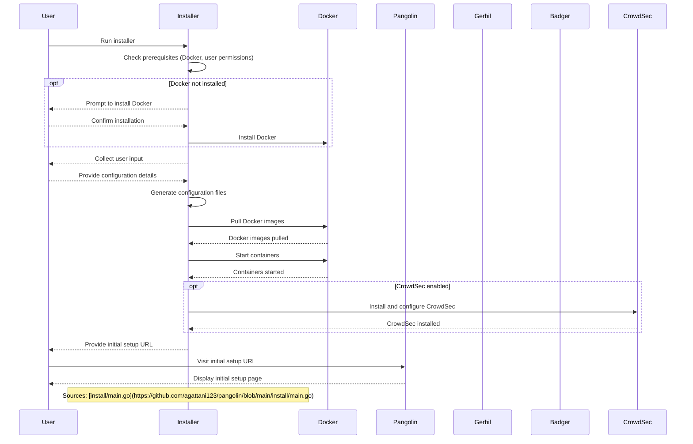

Relevant source files

The following files were used as context for generating this wiki page:

- [install/Makefile](https://github.com/agattani123/pangolin/blob/main/install/Makefile)
- [install/main.go](https://github.com/agattani123/pangolin/blob/main/install/main.go)
- [docker-compose.yml](https://github.com/agattani123/pangolin/blob/main/docker-compose.yml)
- [config/traefik/traefik_config.yml](https://github.com/agattani123/pangolin/blob/main/config/traefik/traefik_config.yml)
- [config/traefik/dynamic_config.yml](https://github.com/agattani123/pangolin/blob/main/config/traefik/dynamic_config.yml)

# Getting Started

## Introduction

The "Getting Started" process is a crucial step in setting up the Pangolin project, an open-source platform for managing and monitoring various services. This process involves installing and configuring the necessary components, including Pangolin itself, Gerbil (an optional tunneling service), Badger (a reverse proxy), and CrowdSec (an optional security tool).

The installation process is facilitated by a Go-based installer application, which guides users through a series of prompts to collect the required configuration details. These details include the base domain, dashboard domain, email for Let's Encrypt certificates, SMTP settings for email functionality, and options to enable or disable specific components like Gerbil and CrowdSec.

Once the configuration is complete, the installer creates the necessary configuration files and directories, pulls the required Docker images, and starts the containers. The installer also provides the option to install Docker if it's not already present on the system.

Sources: [install/main.go](https://github.com/agattani123/pangolin/blob/main/install/main.go), [install/Makefile](https://github.com/agattani123/pangolin/blob/main/install/Makefile)

## Installation Process

The installation process consists of the following steps:

1. **Check Prerequisites**: The installer checks if Docker is installed and if the current user is part of the `docker` group (on Linux systems). If Docker is not installed, the installer offers to install it automatically.

2. **Collect User Input**: If no existing configuration is found, the installer prompts the user for various configuration details, such as the base domain, dashboard domain, Let's Encrypt email, SMTP settings, and options to enable or disable specific components.

3. **Create Configuration Files**: Based on the user input, the installer generates the necessary configuration files, including `docker-compose.yml`, Traefik configuration files, and other component-specific configuration files.

4. **Pull Docker Images**: The installer pulls the required Docker images for Pangolin, Gerbil, Badger, and CrowdSec (if enabled).

5. **Start Containers**: After pulling the images, the installer starts the containers using the `docker-compose` command.

6. **CrowdSec Installation (Optional)**: If the user chooses to install CrowdSec, the installer performs additional steps to configure and integrate CrowdSec with the Pangolin setup.

7. **Initial Setup**: Finally, the installer provides a URL for the initial setup of the Pangolin dashboard.

Sources: [install/main.go](https://github.com/agattani123/pangolin/blob/main/install/main.go)

## Configuration Management

The installer application manages the configuration of various components through the following mechanisms:

1. **Version Management**: The installer fetches the latest versions of Pangolin, Gerbil, and Badger from their respective GitHub repositories and updates the configuration files accordingly.

2. **Configuration File Generation**: The installer uses Go's `text/template` package to generate configuration files based on the user input. These files are embedded within the installer binary using the `embed` package.

3. **Secret Generation**: The installer generates a random secret key for secure communication between components.

4. **Configuration Persistence**: The generated configuration files are stored in the `config` directory, allowing for future modifications or updates.

Sources: [install/Makefile](https://github.com/agattani123/pangolin/blob/main/install/Makefile), [install/main.go](https://github.com/agattani123/pangolin/blob/main/install/main.go)

## Docker Compose Integration

The Pangolin project heavily relies on Docker and Docker Compose for containerization and orchestration. The installer generates a `docker-compose.yml` file based on the user's configuration choices, which defines the services and their configurations.

The `docker-compose.yml` file included in the repository defines a development application service (`app`) with various environment variables, port mappings, and volume mounts for hot reloading and code changes.

Sources: [docker-compose.yml](https://github.com/agattani123/pangolin/blob/main/docker-compose.yml)

## Sequence Diagram: Installation Process

This sequence diagram illustrates the high-level flow of the installation process, including the interactions between the user, the installer application, Docker, and the various components (Pangolin, Gerbil, Badger, and CrowdSec).

## Configuration Options

The installer prompts the user for various configuration options, which are then used to generate the appropriate configuration files. Here are the key configuration options:

| Option                  | Description                                                  | Type     | Default Value                |
|-------------------------|--------------------------------------------------------------|----------|-------------------------------|
| `BaseDomain`            | The base domain for the installation (e.g., example.com)     | string   | (required)                   |
| `DashboardDomain`       | The domain for the Pangolin dashboard                        | string   | `pangolin.BaseDomain`        |
| `LetsEncryptEmail`      | Email for Let's Encrypt certificates                         | string   | (required)                   |
| `InstallGerbil`         | Whether to install Gerbil for tunneled connections           | boolean  | `true`                       |
| `EnableEmail`           | Enable email functionality (SMTP)                            | boolean  | `false`                      |
| `EmailSMTPHost`         | SMTP host for email                                          | string   | (required if `EnableEmail`)  |
| `EmailSMTPPort`         | SMTP port for email                                          | integer  | `587`                        |
| `EmailSMTPUser`         | SMTP username for email                                      | string   | (required if `EnableEmail`)  |
| `EmailSMTPPass`         | SMTP password for email                                      | string   | (required if `EnableEmail`)  |
| `EmailNoReply`          | No-reply email address                                       | string   | (required if `EnableEmail`)  |
| `DoCrowdsecInstall`     | Whether to install CrowdSec                                  | boolean  | `false`                      |
| `TraefikBouncerKey`     | Traefik Bouncer key (not prompted, generated automatically)  | string   | (auto-generated)             |
| `Secret`                | Secret key for secure communication                          | string   | (auto-generated)             |

Sources: [install/main.go](https://github.com/agattani123/pangolin/blob/main/install/main.go)

## Conclusion

The "Getting Started" process is a crucial step in setting up the Pangolin project, ensuring that all necessary components are installed, configured, and running correctly. The installer application simplifies this process by guiding users through a series of prompts, generating configuration files, and managing the installation of Docker and the required components. With the provided initial setup URL, users can complete the final steps and begin using the Pangolin platform.