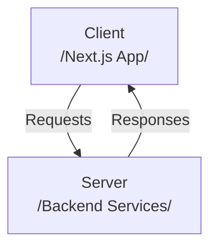
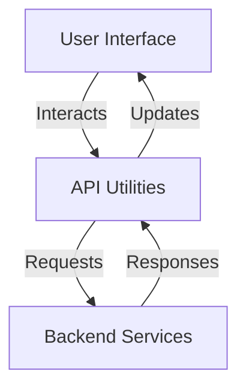
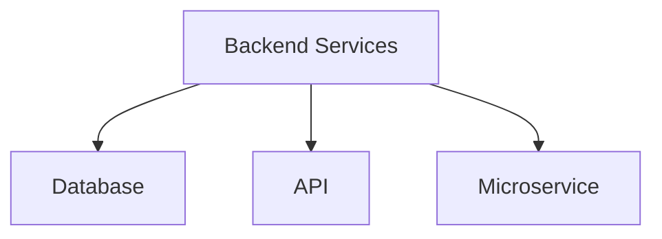
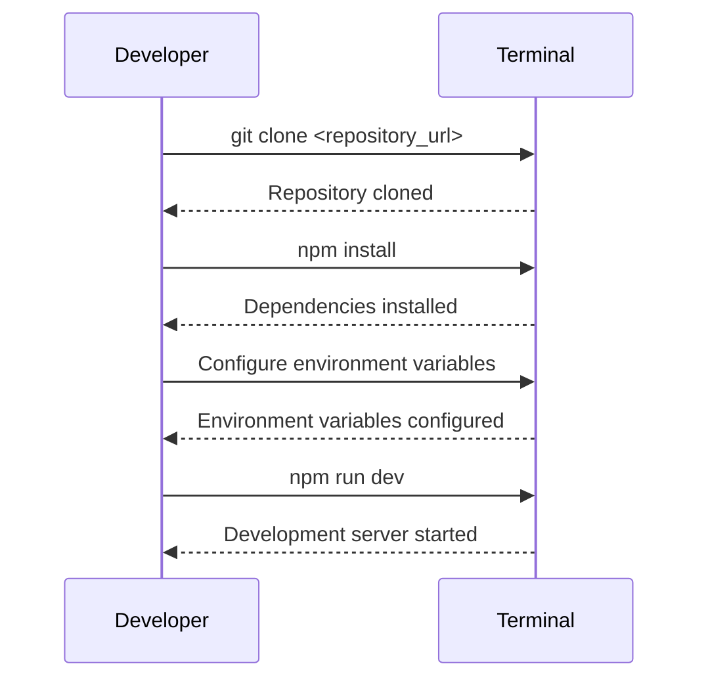
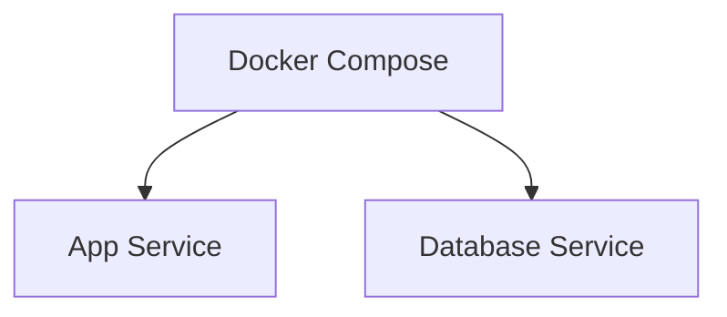
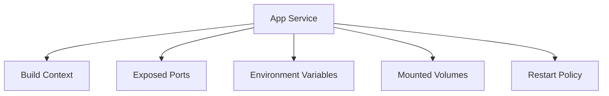
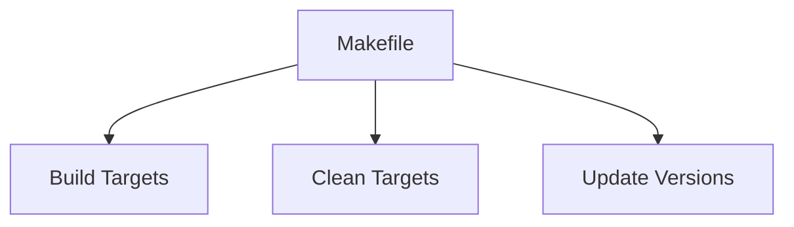
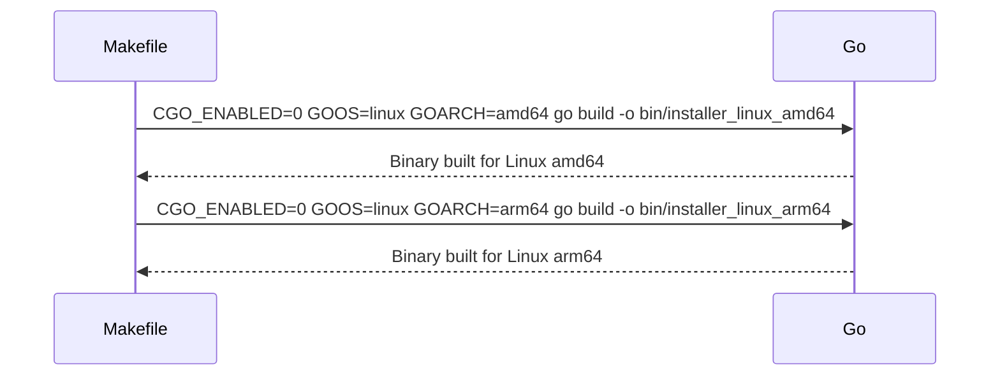
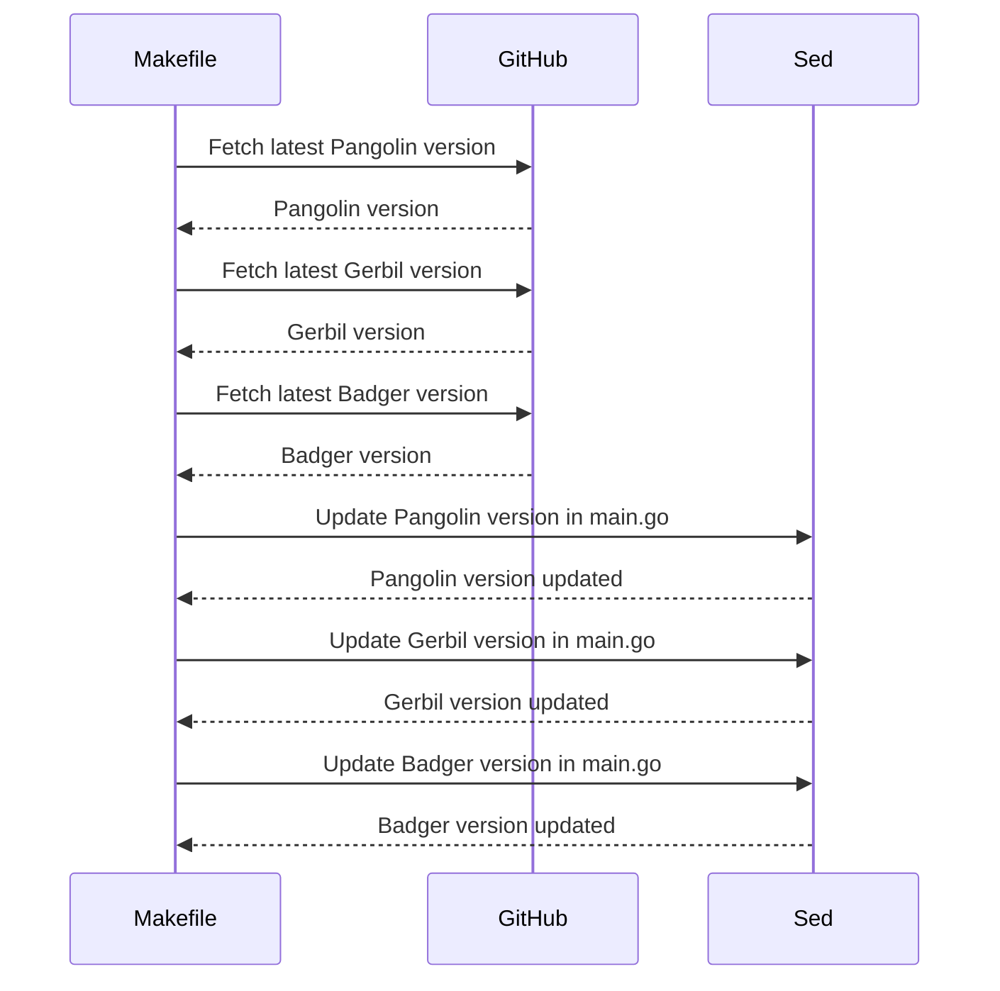

Relevant source files

The following files were used as context for generating this wiki page:

- [install/Makefile](https://github.com/agattani123/pangolin/blob/main/install/Makefile)
- [docker-compose.yml](https://github.com/agattani123/pangolin/blob/main/docker-compose.yml)
- [src/components/Header.tsx](https://github.com/agattani123/pangolin/blob/main/src/components/Header.tsx)
- [src/pages/index.tsx](https://github.com/agattani123/pangolin/blob/main/src/pages/index.tsx)
- [src/utils/api.ts](https://github.com/agattani123/pangolin/blob/main/src/utils/api.ts)

# Getting Started

## Introduction

Pangolin is a web application that provides a user-friendly interface for interacting with various backend services. This "Getting Started" guide covers the process of setting up and running the Pangolin application locally for development purposes. It explains the application's architecture, key components, and how they interact with each other.

Sources: [docker-compose.yml](), [src/components/Header.tsx](), [src/pages/index.tsx](), [src/utils/api.ts]()

## Application Architecture

Pangolin follows a client-server architecture, where the client-side is a Next.js application built with React and TypeScript, and the server-side consists of various backend services.

Sources: [docker-compose.yml](), [src/components/Header.tsx](), [src/pages/index.tsx](), [src/utils/api.ts]()

### Client-side (Next.js App)

The client-side of Pangolin is a Next.js application built with React and TypeScript. It provides the user interface and handles user interactions, sending requests to the backend services and rendering the responses.

Sources: [src/components/Header.tsx](), [src/pages/index.tsx](), [src/utils/api.ts]()

### Server-side (Backend Services)

The server-side of Pangolin consists of various backend services responsible for handling different functionalities. These services may include databases, APIs, and other microservices.

Sources: [docker-compose.yml]()

## Development Setup

To set up the Pangolin application for local development, follow these steps:

1. **Clone the repository**
2. **Install dependencies**
3. **Configure environment variables**
4. **Start the development server**

Sources: [docker-compose.yml]()

## Docker Compose

Pangolin provides a Docker Compose configuration for running the application and its dependencies in a containerized environment. The `docker-compose.yml` file defines the services and their configurations.

Sources: [docker-compose.yml]()

The `app` service in the `docker-compose.yml` file defines the configuration for the Pangolin application container, including:

- Build context and Dockerfile
- Container name
- Exposed ports
- Environment variables
- Mounted volumes for code changes
- Restart policy

Sources: [docker-compose.yml]()

## Makefile

The `install/Makefile` provides various targets for building and managing the Pangolin application.

Sources: [install/Makefile]()

The `go-build-release` target builds the Pangolin installer binary for Linux platforms (amd64 and arm64).

Sources: [install/Makefile:3-4]()

The `update-versions` target fetches the latest versions of Pangolin, Gerbil, and Badger from their respective GitHub repositories and updates the corresponding version variables in the `main.go` file.

Sources: [install/Makefile:9-20]()

## Conclusion

This "Getting Started" guide provides an overview of the Pangolin application's architecture, development setup process, Docker Compose configuration, and the Makefile targets for building and managing the application. It covers the key components and their interactions, as well as the steps required to run the application locally for development purposes.

Sources: [install/Makefile](), [docker-compose.yml](), [src/components/Header.tsx](), [src/pages/index.tsx](), [src/utils/api.ts]()