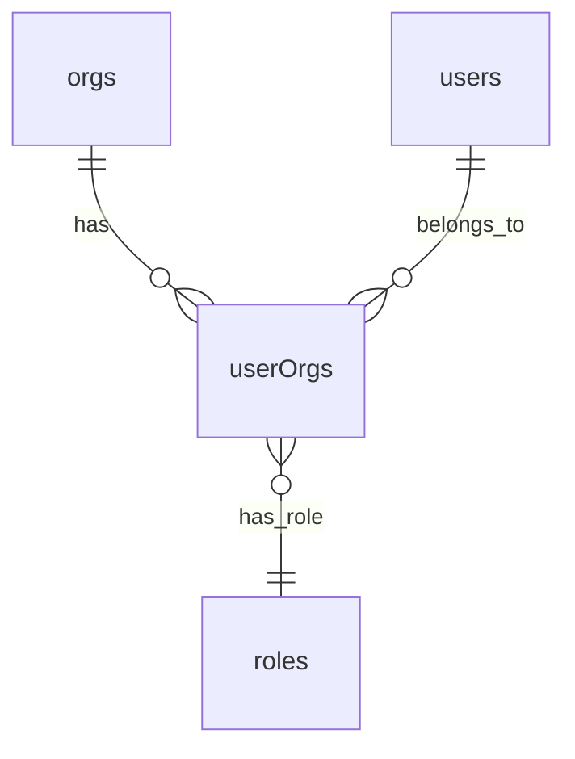
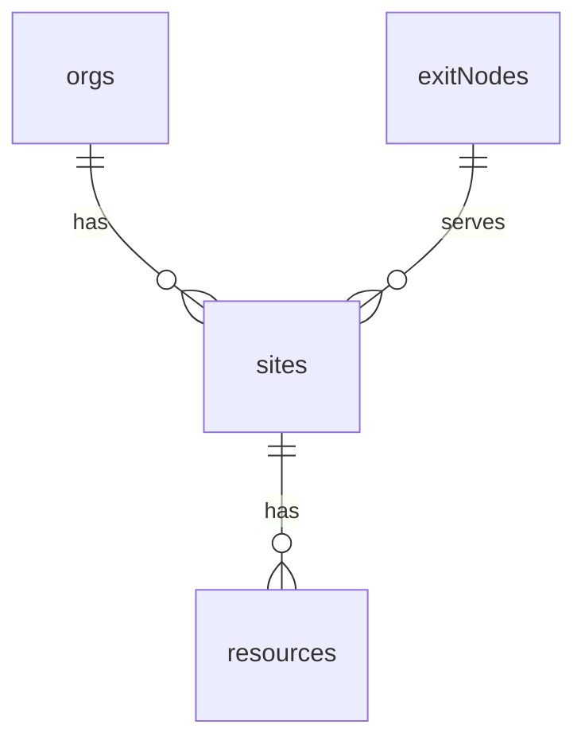
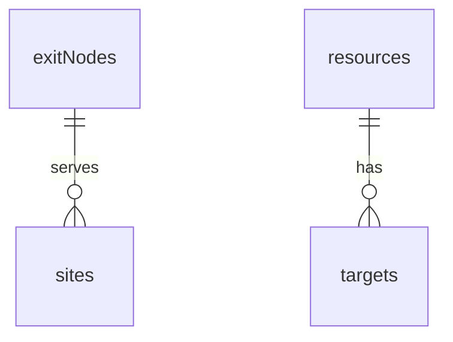
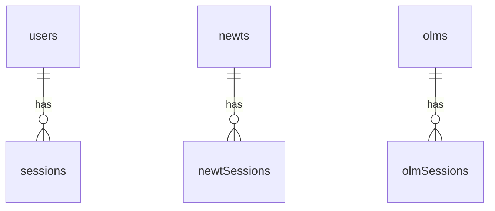
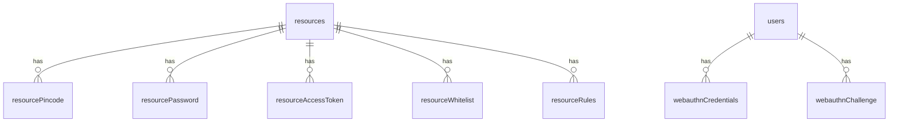
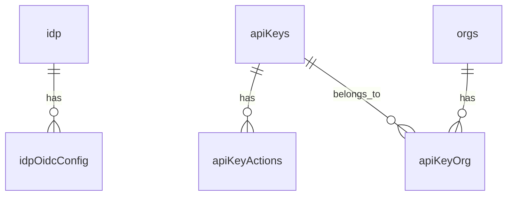
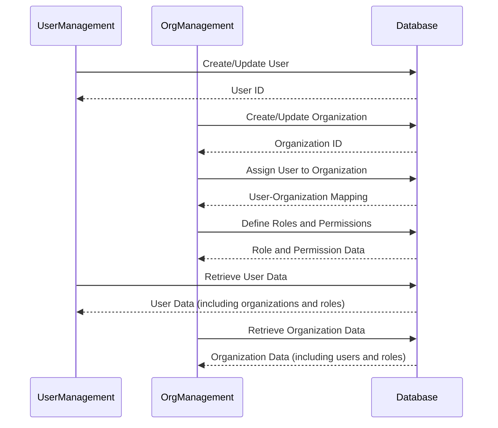
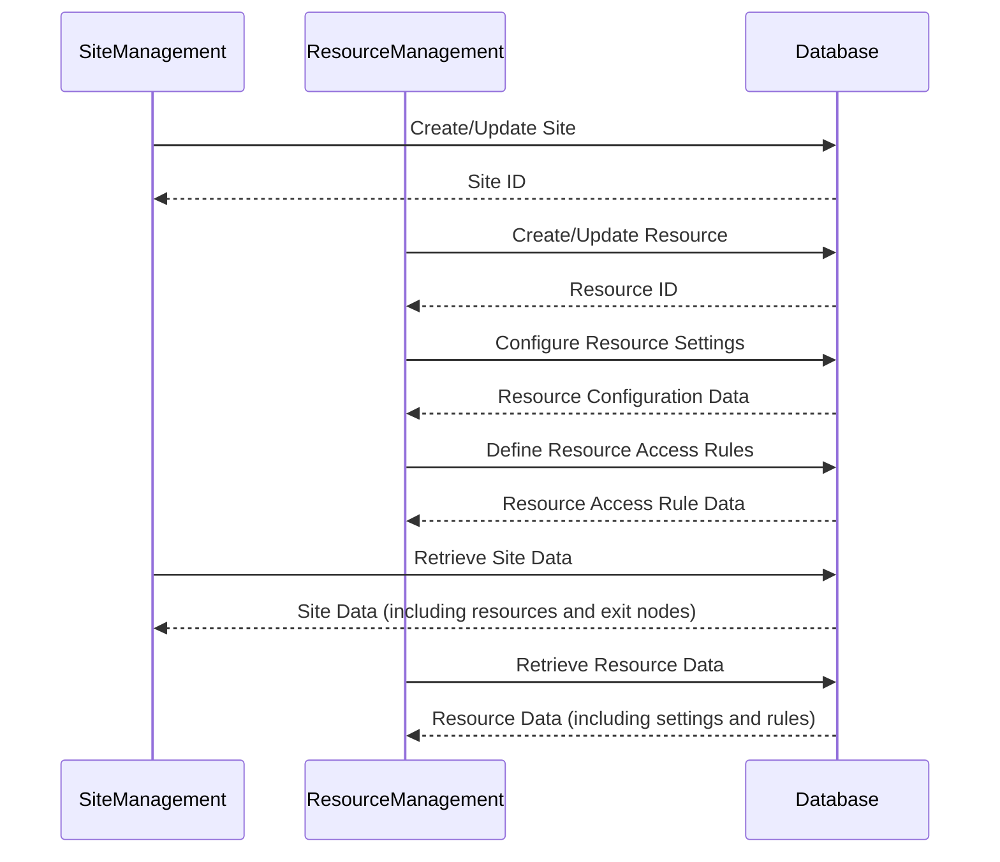
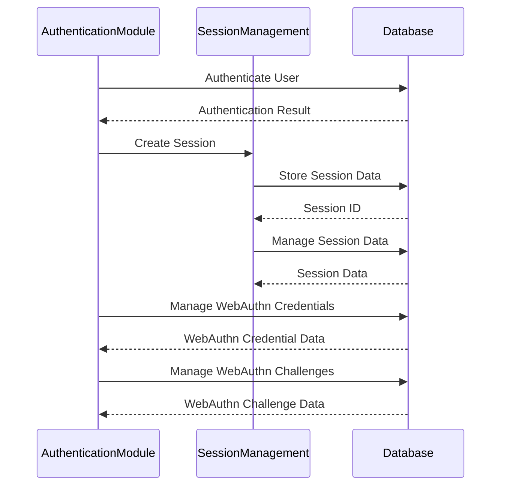
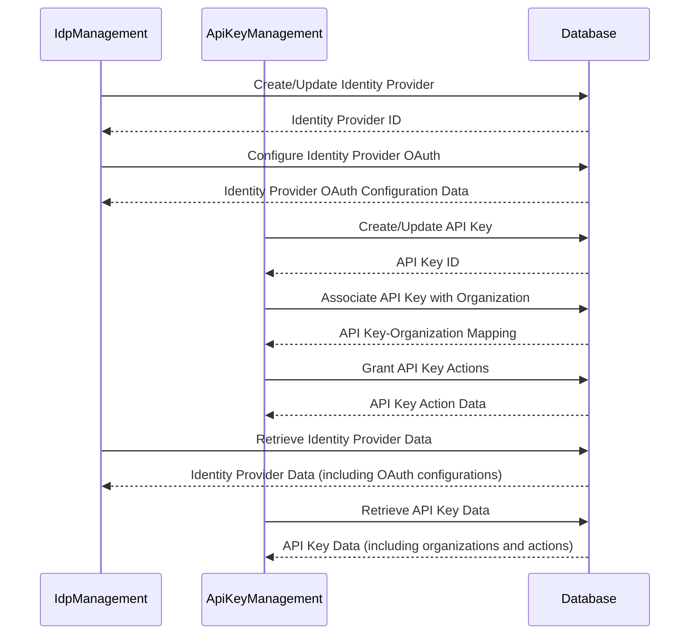

<details>
<summary>Relevant source files</summary>

The following files were used as context for generating this wiki page:

- [server/db/README.md](https://github.com/agattani123/pangolin/blob/main/server/db/README.md)
- [server/db/pg/schema.ts](https://github.com/agattani123/pangolin/blob/main/server/db/pg/schema.ts)
- [server/db/sqlite/schema.ts](https://github.com/agattani123/pangolin/blob/main/server/db/sqlite/schema.ts)
</details>

# Data Flow & Management

## Introduction

The Pangolin project utilizes a database system to manage and persist various types of data related to its functionality. The database schema is defined separately for PostgreSQL and SQLite databases, allowing the project to support both database engines. The data flow and management within the project revolve around the defined database schema, which encompasses multiple tables and relationships to store and organize information such as organizations, users, sites, resources, exit nodes, and more.

The `server/db` directory contains the core files responsible for defining and interacting with the database. The `README.md` file provides an overview of the database setup and migration process, while the `pg/schema.ts` and `sqlite/schema.ts` files define the respective database schemas for PostgreSQL and SQLite.

## Database Schema

The database schema is the foundation for data storage and retrieval within the Pangolin project. It consists of numerous tables, each designed to store specific types of data and maintain relationships between them.

### Key Tables and Relationships

#### Organizations and Users

The `orgs` table stores information about organizations, including their unique identifiers (`orgId`), names, and subnets. The `users` table holds user data, such as user IDs (`userId`), email addresses, usernames, password hashes, and two-factor authentication settings.

The `userOrgs` table establishes a many-to-many relationship between users and organizations, allowing a user to belong to multiple organizations and an organization to have multiple users. This relationship is further extended with the `roles` table, which defines different roles within an organization, such as admin or regular user.



Sources: [server/db/pg/schema.ts](https://github.com/agattani123/pangolin/blob/main/server/db/pg/schema.ts), [server/db/sqlite/schema.ts](https://github.com/agattani123/pangolin/blob/main/server/db/sqlite/schema.ts)

#### Sites and Resources

The `sites` table stores information about sites, which can be associated with organizations (`orgId`) and exit nodes (`exitNodeId`). Each site has properties like a name, public key, subnet, and online status.

The `resources` table holds data about resources, which are linked to sites (`siteId`) and organizations (`orgId`). Resources have various properties, such as names, subdomains, full domains, SSL settings, access control settings, and protocol configurations.



Sources: [server/db/pg/schema.ts](https://github.com/agattani123/pangolin/blob/main/server/db/pg/schema.ts), [server/db/sqlite/schema.ts](https://github.com/agattani123/pangolin/blob/main/server/db/sqlite/schema.ts)

#### Exit Nodes and Targets

The `exitNodes` table stores information about exit nodes, which are used to connect to sites. Each exit node has properties like a name, address, endpoint, public key, and listen port.

The `targets` table holds data about targets, which are associated with resources (`resourceId`). Targets have properties such as IP addresses, methods, ports, and internal ports.



Sources: [server/db/pg/schema.ts](https://github.com/agattani123/pangolin/blob/main/server/db/pg/schema.ts), [server/db/sqlite/schema.ts](https://github.com/agattani123/pangolin/blob/main/server/db/sqlite/schema.ts)

#### Sessions and Authentication

The `sessions` table stores session data for user authentication, including session IDs, user IDs, and expiration times.

The `newts` and `newtSessions` tables are related to the Newt component, which handles session management for Newt clients.

The `olms` and `olmSessions` tables are related to the OLM (Oblivious Load Balancer) component, which manages sessions for OLM clients.



Sources: [server/db/pg/schema.ts](https://github.com/agattani123/pangolin/blob/main/server/db/pg/schema.ts), [server/db/sqlite/schema.ts](https://github.com/agattani123/pangolin/blob/main/server/db/sqlite/schema.ts)

#### Access Control and Security

The `resourcePincode`, `resourcePassword`, `resourceAccessToken`, and `resourceWhitelist` tables are used for access control and security mechanisms related to resources.

The `resourceRules` table stores rules for controlling access to resources based on various criteria, such as IP addresses, paths, and CIDR ranges.

The `webauthnCredentials` and `webauthnChallenge` tables are used for managing WebAuthn (Web Authentication) credentials and challenges, which provide an additional layer of security for user authentication.



Sources: [server/db/pg/schema.ts](https://github.com/agattani123/pangolin/blob/main/server/db/pg/schema.ts), [server/db/sqlite/schema.ts](https://github.com/agattani123/pangolin/blob/main/server/db/sqlite/schema.ts)

#### Identity Providers and API Keys

The `idp` and `idpOidcConfig` tables store information about identity providers and their OAuth configurations, which are used for authentication and authorization purposes.

The `apiKeys` table holds data about API keys, which can be associated with organizations (`apiKeyOrg`) and granted specific actions (`apiKeyActions`).



Sources: [server/db/pg/schema.ts](https://github.com/agattani123/pangolin/blob/main/server/db/pg/schema.ts), [server/db/sqlite/schema.ts](https://github.com/agattani123/pangolin/blob/main/server/db/sqlite/schema.ts)

#### Other Tables

The schema also includes tables for storing domains (`domains`), email verification codes (`emailVerificationCodes`), password reset tokens (`passwordResetTokens`), actions (`actions`), role actions (`roleActions`), user actions (`userActions`), role sites (`roleSites`), user sites (`userSites`), role resources (`roleResources`), user resources (`userResources`), user invites (`userInvites`), and supporter keys (`supporterKey`).

These tables are used for various purposes, such as domain management, email verification, password reset functionality, role-based access control, user invitations, and supporter key management.

## Data Flow and Management

The data flow and management within the Pangolin project revolve around the defined database schema and the interactions between different components and modules of the system.

### User and Organization Management

The `users` and `orgs` tables, along with their related tables (`userOrgs`, `roles`, `roleActions`, `userActions`, `roleSites`, `userSites`, `roleResources`, and `userResources`), facilitate the management of users, organizations, and their respective roles and permissions.

Users can be associated with multiple organizations, and each organization can have various roles defined with specific actions and resource access permissions. This allows for fine-grained control over user access and privileges within the system.



Sources: [server/db/pg/schema.ts](https://github.com/agattani123/pangolin/blob/main/server/db/pg/schema.ts), [server/db/sqlite/schema.ts](https://github.com/agattani123/pangolin/blob/main/server/db/sqlite/schema.ts)

### Site and Resource Management

The `sites` and `resources` tables, along with their related tables (`targets`, `exitNodes`, `resourcePincode`, `resourcePassword`, `resourceAccessToken`, `resourceWhitelist`, and `resourceRules`), facilitate the management of sites, resources, and their associated configurations and access control mechanisms.

Sites can be associated with organizations and exit nodes, while resources can be linked to sites, organizations, and domains. Resources can have various settings and rules defined, such as SSL configurations, access control lists, and resource-specific rules for controlling access based on IP addresses, paths, or CIDR ranges.



Sources: [server/db/pg/schema.ts](https://github.com/agattani123/pangolin/blob/main/server/db/pg/schema.ts), [server/db/sqlite/schema.ts](https://github.com/agattani123/pangolin/blob/main/server/db/sqlite/schema.ts)

### Authentication and Session Management

The `sessions`, `newts`, `newtSessions`, `olms`, and `olmSessions` tables are used for managing user authentication and sessions within the system.

The `sessions` table stores user session data, while the `newts` and `newtSessions` tables handle session management for Newt clients. Similarly, the `olms` and `olmSessions` tables manage sessions for OLM clients.

The `webauthnCredentials` and `webauthnChallenge` tables are used for WebAuthn authentication, providing an additional layer of security for user authentication.



Sources: [server/db/pg/schema.ts](https://github.com/agattani123/pangolin/blob/main/server/db/pg/schema.ts), [server/db/sqlite/schema.ts](https://github.com/agattani123/pangolin/blob/main/server/db/sqlite/schema.ts)

### Identity Provider and API Key Management

The `idp`, `idpOidcConfig`, `apiKeys`, `apiKeyActions`, and `apiKeyOrg` tables are used for managing identity providers, their OAuth configurations, and API keys within the system.

Identity providers can be configured with various settings, such as OAuth configurations and default role and organization mappings. API keys can be associated with organizations and granted specific actions, allowing for controlled access to the system's functionality.



Sources: [server/db/pg/schema.ts](https://github.com/agattani123/pangolin/blob/main/server/db/pg/schema.ts), [server/db/sqlite/schema.ts](https://github.com/agattani123/pangolin/blob/main/server/db/sqlite/schema.ts)

### Other Data Management

The database schema also includes tables for managing domains (`domains`), email verification codes (`emailVerificationCodes`), password reset tokens (`passwordResetTokens`), actions (`actions`), supporter keys (`supporterKey`), license keys (`licenseKey`), and host metadata (`hostMeta`).

These tables are used for various purposes, such as domain management, email verification, password reset functionality, supporter key management, license key storage, and host metadata storage.

```mermaid
sequenceDiagram
    participant DomainManagement
    participant EmailVerification
    participant PasswordReset
    participant SupporterKeyManagement
    participant LicenseManagement
    participant HostMetaManagement
    participant Database

    DomainManagement->>Database: Manage Domains
    Database-->>DomainManagement: Domain Data

    EmailVerification->>Database: Store/Retrieve Email Verification Codes
    Database-->>EmailVerification: Email Verification Code Data

    PasswordReset->>Database: Store/Retrieve Password Reset Tokens
    Database-->>PasswordReset: Password Reset Token Data

    SupporterKeyManagement->>Database: Manage Supporter Keys
    Database-->>SupporterKeyManagement: Supporter Key Data

    LicenseManagement->>Database: Store/Retrieve License Keys
    Database-->>LicenseManagement: License Key Data

    HostMetaManagement->>Database: Store/Retrieve Host Metadata
    Database-->>Host