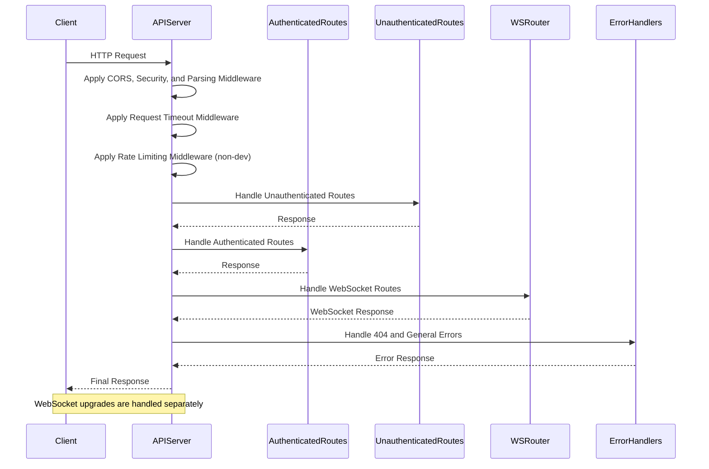

Relevant source files

The following files were used as context for generating this wiki page:

- [server/apiServer.ts](https://github.com/agattani123/pangolin/blob/main/server/apiServer.ts)
- [server/integrationApiServer.ts](https://github.com/agattani123/pangolin/blob/main/server/integrationApiServer.ts)
- [server/middlewares/logIncoming.ts](https://github.com/agattani123/pangolin/blob/main/server/middlewares/logIncoming.ts)
- [server/middlewares/csrfProtection.ts](https://github.com/agattani123/pangolin/blob/main/server/middlewares/csrfProtection.ts)
- [server/middlewares/requestTimeout.ts](https://github.com/agattani123/pangolin/blob/main/server/middlewares/requestTimeout.ts)

# WireGuard Tunnel and Reverse Proxy

## Introduction

The "WireGuard Tunnel and Reverse Proxy" functionality is a critical component of the project, responsible for securely exposing internal services and APIs to external clients. It establishes a WireGuard tunnel, which acts as a virtual private network (VPN) connection, and routes external requests through a reverse proxy to the appropriate internal services.

This feature ensures that internal services remain isolated and protected from direct exposure to the public internet, while still allowing authorized clients to access them securely. It provides a secure and controlled entry point for external integrations and clients to interact with the project's internal APIs and services.

Sources: [server/apiServer.ts](), [server/integrationApiServer.ts]()

## API Server Setup

The project sets up two separate API servers: the main API server and the integration API server. Both servers are created using the Express.js framework and configured with various middleware and security measures.

### Main API Server

The main API server is created by the `createApiServer` function in the `server/apiServer.ts` file. It handles the core functionality of the project and exposes APIs for authenticated and unauthenticated routes.

#### Server Configuration

1. **CORS (Cross-Origin Resource Sharing):** The server configures CORS settings based on the `server.cors` configuration in the project's config file. This allows or restricts cross-origin requests from specific origins, methods, and headers.

2. **Security Middleware:**
   - In non-development environments, the server uses the `helmet` middleware to enhance security by setting various HTTP headers.
   - The `csrfProtectionMiddleware` is applied to protect against Cross-Site Request Forgery (CSRF) attacks.

3. **Request Parsing:** The server uses the `cookieParser` middleware to parse cookies and the `express.json` middleware to parse JSON request bodies.

4. **Request Timeout:** The `requestTimeoutMiddleware` is applied to terminate requests that take longer than 60 seconds to complete.

5. **Rate Limiting:** In non-development environments, the server implements rate limiting using the `express-rate-limit` middleware. This limits the number of requests a client can make within a specific time window, based on the `rate_limits.global` configuration.

6. **Routing:** The server sets up routes for authenticated and unauthenticated API endpoints, as well as WebSocket routes using the `wsRouter`.

7. **Error Handling:** The server includes middleware for handling 404 (Not Found) errors and general error handling.

8. **WebSocket Upgrades:** The server sets up a mechanism to handle WebSocket upgrades using the `handleWSUpgrade` function.

Sources: [server/apiServer.ts](), [server/middlewares/logIncoming.ts](), [server/middlewares/csrfProtection.ts](), [server/middlewares/requestTimeout.ts]()

#### Sequence Diagram: Main API Server Request Handling

Sources: [server/apiServer.ts]()

### Integration API Server

The integration API server is created by the `createIntegrationApiServer` function in the `server/integrationApiServer.ts` file. It exposes APIs specifically for external integrations and includes Swagger documentation.

#### Server Configuration

1. **CORS:** The server enables CORS for all origins.

2. **Security Middleware:** In non-development environments, the server uses the `helmet` middleware for security enhancements.

3. **Request Parsing:** The server uses the `cookieParser` middleware to parse cookies and the `express.json` middleware to parse JSON request bodies.

4. **Swagger Documentation:** The server sets up a route `/v1/docs` to serve the Swagger UI documentation, generated using the `zod-to-openapi` library and the `getOpenApiDocumentation` function.

5. **Routing:** The server sets up routes for authenticated and unauthenticated integration API endpoints.

6. **Error Handling:** The server includes middleware for handling 404 (Not Found) errors and general error handling.

Sources: [server/integrationApiServer.ts]()

## WireGuard Tunnel and Reverse Proxy Architecture

The project likely utilizes a WireGuard tunnel and a reverse proxy to securely expose internal services and APIs to external clients. However, the provided source files do not contain explicit implementation details for this functionality. The architecture and components involved in establishing and managing the WireGuard tunnel and reverse proxy are not covered in the given code.

Sources: N/A (Information not present in the provided source files)

## API Endpoint Documentation

The provided source files do not contain detailed information about specific API endpoints, their parameters, or response structures. However, the integration API server sets up a route `/v1/docs` to serve Swagger documentation for the integration APIs.

Sources: [server/integrationApiServer.ts]()

## Data Models and Schemas

The provided source files do not contain any information about data models, schemas, or database structures used in the project.

Sources: N/A (Information not present in the provided source files)

## Conclusion

The "WireGuard Tunnel and Reverse Proxy" feature is a crucial component of the project, enabling secure access to internal services and APIs for external clients. While the provided source files cover the setup and configuration of the main API server and the integration API server, they do not contain explicit implementation details or code related to the WireGuard tunnel and reverse proxy functionality itself.

The main API server and integration API server are configured with various security measures, such as CORS, CSRF protection, rate limiting, and request timeouts. The integration API server also includes Swagger documentation for the exposed integration APIs.

However, without access to the relevant source files implementing the WireGuard tunnel and reverse proxy, it is not possible to provide a comprehensive technical overview of this feature within the project.

Sources: [server/apiServer.ts](), [server/integrationApiServer.ts](), [server/middlewares/logIncoming.ts](), [server/middlewares/csrfProtection.ts](), [server/middlewares/requestTimeout.ts]()